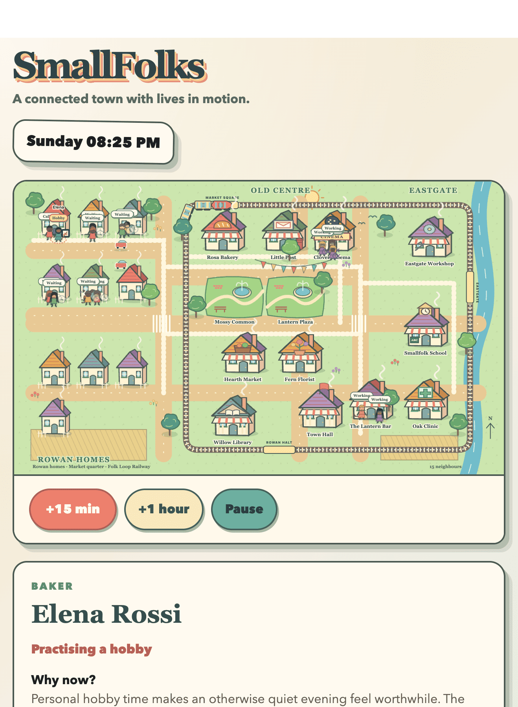

# SmallFolks

**A connected town with lives in motion.** SmallFolks is a small, inspectable life simulator. Watch neighbours move between homes, work, shops and shared spaces as the town clock runs. Select a person, pet or place to see what is happening and, for residents, why they chose their current activity.



The current prototype is a fixed town with fifteen residents, households, a dog, local businesses and a railway. You can pause the simulation or advance its clock by 15 minutes or an hour. The world is saved by the Python backend; the React frontend draws the town and its live activity. Procedural town generation and a broader economy are future work.

## Run locally

Requires Python 3.13, [uv](https://docs.astral.sh/uv/) and Node.js with npm. From the repository root, install the backend dependencies and apply its database migrations:

```bash
uv sync --group dev
cd backend
test -e .env || cp .env.example .env
../.venv/bin/alembic upgrade head
../.venv/bin/python run_dev.py
```

In another terminal, start the frontend:

```bash
cd frontend
npm install
npm run dev
```

Open [http://127.0.0.1:5341/](http://127.0.0.1:5341/). The frontend proxies API requests to the backend on port 5340. The local backend uses SQLite by default.

## Project notes

The [product and technical specification](docs/smallfolk-spec.md) describes the intended simulation. The [implementation plan](docs/next-steps.md) tracks what the prototype covers and what still needs work.
